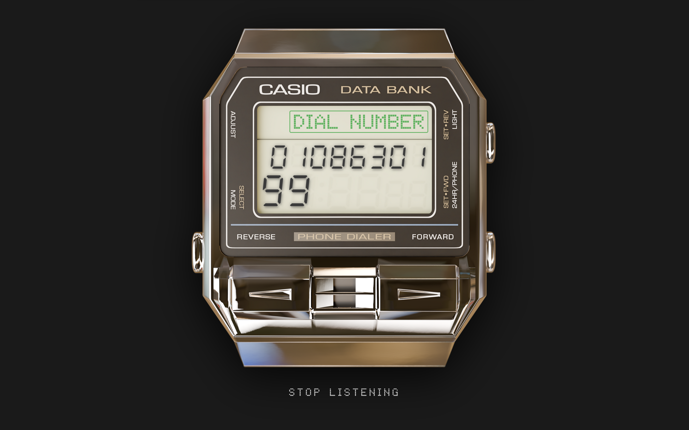

# Casio-Databank-Dialer
A high-performance, lightweight web application designed to listen to the DTMF 'dialer' tones from *Casio Databank DBA-800*/*DBA-80* watches. Decodes in real-time using a C# backend and provides a click-to-dial interface for modern smartphones.

## Status
[](https://github.com/EvianMcKeown/Databank-Dialer/actions/workflows/deploy.yml)


 
## How It Works
1. Open the website on your phone (or any device with a microphone)
2. Hold your DBA-800/DBA-80 close to the microphone
3. Press on the 'Start Listening' button on the interface
4. Play a saved contact number from the watch's phone dialer
5. The web app decodes the tones and displays the number
6. Tap the 'Dial Number' text to dial

## Architecture
This project uses a low-latency audio pipeline to ensure hardware dial tones are captured and processed accurately:
* **Frontend**: TypeScript with *AudioWorklet* for thread-isolated sampling.
* **Transport**: *SignalR* streaming 16-bit PCM data from the browser to the server.
* **Backend**: *ASP.NET Core* (C#) implementing the [*Goertzel Algorithm*](http://en.wikipedia.org/wiki/Goertzel_algorithm) for DTMF frequency detection.

## Technology Used
* **Server**: .NET 10 (C#)
* **Client**: TypeScript (ESNext)
* **Signal Processing**: Goertzel Implementation
* **Communication**: ASP.NET Core SignalR

---

## Project Structure
```text
Casio-Databank-Dialer/
├── src/
│   ├── Scripts/
│   │   ├── app.ts              # UI & SignalR client
│   │   └── audio-processor.ts  # AudioWorklet (DSP thread)
│   ├── wwwroot/
│   │   ├── fonts/
│   │   ├── images/
│   │   ├── js/                 # Compiled JS (git-ignored)
│   │   ├── index.html          # Main UI
│   │   ├── robots.txt
│   │   └── sitemap.xml
│   ├── AudioHub.cs             # SignalR hub
│   ├── Goertzel.cs             # DTMF frequency detection
│   ├── Program.cs              # ASP.NET Core entry point
│   └── src.csproj              # .NET project file
├── tests/
├── Casio-Databank-Dialer.sln
└── LICENSE
```

## Setup & Development
### Prerequisites
* [*.NET SDK*](http://dotnet.microsoft.com/download)
* [*Node.js & npm*](https://nodejs.org/en)

1. ### Install Dependencies
```
# Install .NET packages
dotnet restore

# Install TypeScript & SignalR
npm install
```

2. ### Development Workflow
Run in two separate terminal windows to handle the build process:
#### C# Server
```
dotnet watch
```
#### TypeScript Compiler
```
# Watch and compile TS to wwwroot/js/
npx tsc -w
```

## License
[GNU General Public License 3.0](https://github.com/EvianMcKeown/Casio-Databank-Dialer/blob/dev/LICENSE)
